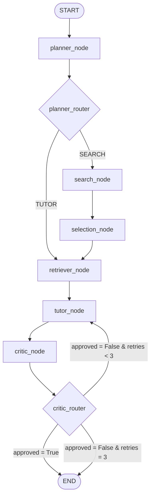

# 🚀 PaperPilot AI

> **"What if we built a graduate research assistant that doesn't sleep, doesn't complain about reading 80-page preprints, and runs on pure Python instead of $6 espresso?"** 

Welcome to **PaperPilot AI** — the autonomous multi-agent research partner designed to actually *understand* scientific literature, not just CTRL+F through it. 

We got tired of boring, generic "Chat with PDF" wrappers that hallucinate formulas and lose context at the page boundary. So, we did what any sane developer running on caffeine at 3:00 AM does: we built our own modular document extraction substrate, rolled our own mathematical ranker, and wired it all up into a stateful, self-correcting agent graph using **LangGraph**.

No magic. No bloated pre-made QA chains. Just clean engineering.

---

## 🧠 The Architecture (Why this is peak engineering)

PaperPilot is built as a stateful directed graph. It doesn't just run top-to-bottom; it plans, searches, reads, generates, critiques itself, and loops back if it detects a slip-up.



### 🛰️ The Discovery Layer (Search Agent)
Why search Semantic Scholar and arXiv manually? Our search agent queries both, merges duplicates using a **word-level Jaccard similarity index** (meaning it matches `"Title: A"` and `"A: Title"` instantly), and sorts results using a custom **multi-factor ranker**:
*   **Semantic Relevance**: Embedding cosine similarity against the search intent.
*   **Citation Impact**: Normalised using a **logarithmic scale** so that a single paper with 100k citations doesn't completely wipe out fresh breakthroughs.
*   **Recency**: An **exponential age decay function** ($e^{-\lambda \cdot t}$) that keeps the research cutting-edge.

### 📄 The Parsing Substrate (Milestone 1 & 2)
We extract text page-by-page using PyMuPDF, clean up ligatures and hyphenation artifacts on line breaks, and split text using a **recursive character chunker** with configurable overlap. 
These chunks are embedded locally using `all-MiniLM-L6-v2` and indexed in a local **FAISS vector store**. Because FAISS only speaks vectors and integers, we built a mapping layer to translate FAISS index positions back to our immutable domain UUIDs.

### 🔄 The Self-Correction Loop (Tutor-Critic Loop)
Our **Tutor Agent** generates responses strictly grounded in the retrieved chunks. Once done, the **Critic Agent** audits the draft. If it finds *any* claim not explicitly backed by the context, it REJECTS the draft, logs the violation, and forces the Tutor to regenerate. If it fails 3 times, the graph exits cleanly to prevent infinite loops.

---

## ⚡ Quick Start (Get it running in 60 seconds)

### 1. Clone & Set Up Virtual Env
```bash
# Clone the repository
git clone https://github.com/Rg9906/Research_Assistant.git
cd Research_Assistant

# Create and activate your virtual environment
python -m venv .venv
.venv\Scripts\activate  # Windows
source .venv/bin/activate  # macOS/Linux
```

### 2. Install Dependencies (Warning: PyTorch is heavy!)
```bash
pip install -e ".[dev]"
```
*Note: This will install PyTorch, Hugging Face Transformers, FAISS, and LangGraph. Grab a coffee, it takes a couple of minutes.*

### 3. Setup Your Keys
Copy the environment template and add your API credentials:
```bash
copy .env.example .env
```
Inside `.env`:
```env
OPENAI_API_KEY=your-actual-api-key-here
# Optional: SEMANTIC_SCHOLAR_API_KEY=your-key-here
```

### 4. Run the Test Suite (100% Offline verification!)
We mock all API calls in our unit tests so you can verify the entire graph logic, mathematics, and FAISS operations instantly without burning your OpenAI quota:
```bash
pytest tests/ -v
```
*Expected output: `103 passed, 1 skipped` (The integration test skips gracefully if no valid API key is present).*

---

## 📂 Code Layout

```
src/paperpilot/
├── core/           # Data models (PaperMetadata, TextChunk, ProcessedDocument)
├── document/       # Text extractor & recursive character chunker
├── retrieval/      # Embedder (SentenceTransformers) & Vector Store (FAISS wrapper)
├── agent/          # LLM Tutor Agent
├── search/         # Academic Search Providers & Weighted Paper Ranker
├── graph/          # LangGraph state definitions, nodes, and builder
├── config.py       # Pydantic settings and defaults
└── pipeline.py     # Simple facade connecting retrieval to generation
```

---

## 🗺️ What's Next? (The Roadmap)

*   [x] **Milestone 6**: Expanding Planner, Tutor, and Critic agents for multi-step execution plans and hierarchical critique audits.
*   [x] **Milestone 7**: Workspace Management (managing multiple papers in a single workspace database).
*   [x] **Milestone 8**: Direct PDF Downloader and metadata sync.
*   [ ] **Milestone 9**: Interactive Frontend (Streamlit or React/Vite dashboard).

---

## 🛡️ License

MIT. Built with ☕ and late-night compilation sessions. If this helped you write a paper or save time, drop a star!
